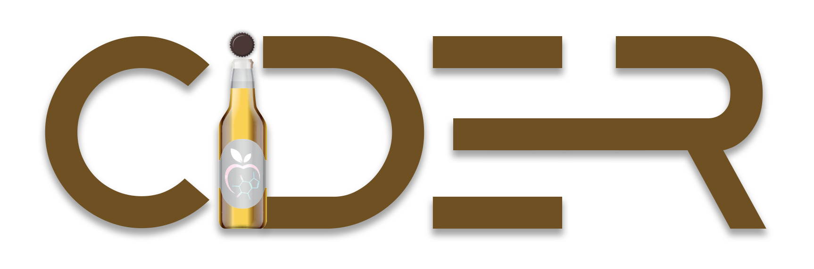

<p align="center"><a href="https://chemical-dataset-comparator.readthedocs.io/en/latest/" target="_blank"></a></p>

[](https://opensource.org/licenses/MIT)
[](https://GitHub.com/Steinbeck-Lab/ChemIcal-DatasEt-comparatoR/graphs/commit-activity)
[](https://GitHub.com/Steinbeck-Lab/ChemIcal-DatasEt-comparatoR/issues/)
[](https://GitHub.com/Steinbeck-Lab/ChemIcal_DatasEt_compaRator/graphs/contributors/)
[](https://github.com/Steinbeck-Lab/ChemIcal-DatasEt-comparatoR/releases/)
[](https://www.rdkit.org/)

[](https://zenodo.org/badge/latestdoi/501949039)
[](https://chemical-dataset-comparator.readthedocs.io/en/latest/?badge=latest)
[](https://pypi.python.org/pypi/cider-chem/)

# Overview of ChemIcal DatasEt comparatoR (CIDER) :globe_with_meridians:
- ChemIcal DatasEt comparatoR (CIDER) is a Python package and ready-to-use Jupyter Notebook workflow which primarily utilizes RDKit to compare two or more chemical structure datasets (SD files) in different aspects, e.g. size, overlap, molecular descriptor distributions, chemical space clustering, etc., most of which can be visually inspected in the notebook.

## Usage
-  To use CIDER, clone the repository to your local disk and make sure you install all the necessary requirements.

### We recommend to use CIDER inside a Conda environment to facilitate the installation of the dependencies.

- Conda can be downloaded as part of the [Anaconda](https://www.anaconda.com/) or the [Miniconda](https://conda.io/en/latest/miniconda.html) platforms (Python 3.10). We recommend to install miniconda3. Using Linux you can get it with:

```shell
$ wget https://repo.anaconda.com/miniconda/Miniconda3-latest-Linux-x86_64.sh
$ bash Miniconda3-latest-Linux-x86_64.sh
```
### Installation

```shell
$ git clone https://github.com/Steinbeck-Lab/ChemIcal_DatasEt_compaRator.git
$ cd ChemIcal_DatasEt_compaRator
$ conda create --name cider_chem python=3.10
$ conda activate cider_chem
$ conda install pip
$ python -m pip install -U pip #Upgrade pip
$ pip install .
```
- Note: Make sure all installations are working correctly by running the tests. You can do this by running the pytest command in the repository root folder.

### Alternative
```shell
$ python -m pip install -U pip #Upgrade pip
$ pip install git+https://github.com/Steinbeck-Lab/ChemIcal_DatasEt_compaRator.git
```

### Install from PyPI
```shell
$ pip install cider-chem
```

### Basic usage:
```python
from CIDER import ChemicalDatasetComparator
cider = ChemicalDatasetComparator()

data_dir = './data/'  # dir with sd files containing molecules
testdict = cider.import_as_data_dict(data_dir)
cider.get_number_of_molecules(testdict)

```
### Documentation
- The documentation for the CIDER package can be found [here](https://chemical-dataset-comparator.readthedocs.io/en/latest/?badge=latest).

### Cite us
- Busch, H., Schaub, J., Brinkhaus, H. O., Rajan, K., & Steinbeck, C. (2022). ChemIcal DatasEt comparatoR CIDER (Version 0.0.1-dev) [Computer software]. https://doi.org/10.5281/zenodo.6630494

## Maintained by :wrench:
ChemIcal DatasEt comparatoR is developed and maintained by the [Steinbeck group](https://cheminf.uni-jena.de) at the [Friedrich Schiller University](https://www.uni-jena.de/en/) Jena, Germany.
The code for this web application is released under the [MIT license](https://opensource.org/licenses/MIT). Copyright © CC-BY-SA 2024


[](https://cheminf.uni-jena.de)
